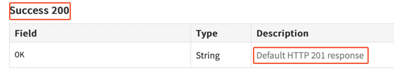

# Riverty-home-assignment
This repo is for the home assignment from Riverty

This repo uses the Fluent Assertions package. According to its license, it's free for non-commercial use and since this is a home task, I don't mind using it.
Due to time restrictions, I didn't get to create a proper logging utility that will let me use debug/info/exception/etc. logs that will show on the console and be written to a file.

*Note: I had to target NET8.0 instead of NET9.0 for this repo in order to run the code on github actions

# Bugs I found
1. You can create a booking with a negative total price
2. The server returns a 418 (I'm a teapot) response when trying to create bookings without adding the Accept header to the request
3. Can create a booking with empty first and last names
4. The checkin date filter doesn't work as expected, it only returns bookings with a checking date **greater** than what we send in, and not equal or greater
   1. This causes the tests with both the checkin and checkout filters to fail
5. Inconsistent documentation on the response to the DELETE endpoint, says that success is a 200 response code on top, and 201 in the description:
   
6. When creating a booking with a total price that is not a whole number, the number is rounded down when saved in the server


# How to run the docker
1. cd into the solution file
2. build the docker image
3. run the image

```
> cd RestfulBookerTests
> docker build -t <image-name> .
> docker run -v $(pwd)/test-results:/app/test-results <image-name>
```

After the run is over, you will have a .trx results file in RestfulBookerTests/test-results

## Allure
If you prefer to see an allure report, first you need to install the Allure CLI tool

`brew install allure`

Then build the docker regularly and run the following script
```
docker run -v $(pwd)/allure-results:/app/bin/Debug/net9.0/allure-results <image-name>
allure generate allure-results --clean 
allure open
```
